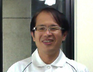

Resume (Brief)
===============

Chen Chung-Shu 陳鍾樞

.. No.10, Aly. 430, Ziqiang S. Rd., Zhubei City, Hsinchu County 302, Taiwan (R.O.C.).                       		    

.. Phone: 886-3-6681193  Cell phone: 886-970577923 (UTC+8:02)

E-mail: gamma_chen@yahoo.com.tw

Personal website  http://jonathan2251.github.com/ws/index.html

..  Objective
    ---------

    LLVM compiler engineer

My publish books, LLVM open source work:
----------------------------------------

.. raw:: html

    <ul>
    <li>
    <a href="http://jonathan2251.github.com/lbd/index.html">
    Tutorial: Creating an LLVM Backend for the Cpu0 Architecture</a>
    </li>
    </ul>

    <ul>
    <li>
    <a href="http://jonathan2251.github.com/lbt/index.html">
    Tutorial: Creating an LLVM toolchain for the Cpu0 Architecture</a>
    </li>
    </ul>

Qualifications
--------------

- Nearly 20 years of programming experience which include knowledge of llvm 
  compiler, ARM and MIPS CPU, C++/C OOP/OOD and embedded system and related 
  software tools and hardware equipment listed as below. 

Skills
------

Computer language:
~~~~~~~~~~~~~~~~~~

- Familiar with OOA/OOP, UML, Design Pattern, STL, C++, cmake, Linux device 
  driver and Linux programming, Keil C (8051 C compiler). Knowing and has real 
  experience in programming of VC/Window Programming, VB, javascript/html/css.

Software Tools:
~~~~~~~~~~~~~~~~

- Rational Rose (UML tool), Yacc/Lex (Compiler or Language parsing tool), TTCN 
  (protocol verify tool which generate C/C++ code), Install Shield (programming 
  windows install software package tool), SQL (data base language), Linux/gcc 
  tool chains, Code Warrior IDE compiler, clear case/git/svn/cvs software 
  version control system tool, Sphinx/restructuredtext.

Equipments:
~~~~~~~~~~~~

- Digital Scope, Spectrum, Power meter equipments operation.

Special skill:
~~~~~~~~~~~~~~~

- Clang/llvm compiler, Linux Driver, USB, FAT files system, DTV, DECT, 802.11b, 
  JPEG coding, Sorting Algorithm, mips arm7 cpu, 8051 mcu.
  
Personal data
--------------

- Born in 1968, Married.

- Friendly, and enjoy in programming and handling product problem.

Education
----------

- 1997-1999 Master, June 1999, National Taiwan Normal University, Taipei, Major: 
  Computer Science

- 1991-1994 B.S., June 1994, National Taiwan Technology University of Science 
  and Technology, Taipei, Major: Industry Engineer

Licenses
--------
	
- Computer Engineer license, 1995 高考資訊技師及格

My published paper:
-------------------

-  `行排列法簡化步驟之研究 <http://ir.lib.ntnu.edu.tw/ir/handle/309250000Q/22072?locale=en-US>`_

Thesis of master degree:
------------------------

- https://github.com/Jonathan2251/ow/tree/master/sortingnetwork/ThesisMaster

Proposal of PHD study
---------------------

- https://github.com/Jonathan2251/ow/tree/master/sortingnetwork/PHD

Home work for courses in postgraduate
-------------------------------------

- https://github.com/Jonathan2251/ow/tree/master/master-homework

Experience
-----------

March 2013 - November 2016: Marvell
~~~~~~~~~~~~~~~~~~~~~~~~~~~~~~~~~~~

- Work as an CPU engineer in Marvell SOC company.

  - Implement ARM CPU simulator for correction verification.

- Worked as an llvm engineer in Marvell SOC company.

  - Propose importing polly in loop optimization for Marvell llvm toolchain on 
    ARM SOC CPU.

  - Modify clang as OpenCL team request.

- Semi-auto system for gcc compiler optimization system.

- Member of Marvell welfare committee.

August 2012 - March 2013: LLVM community
~~~~~~~~~~~~~~~~~~~~~~~~~~~~~~~~~~~~~~~~

- Writing llvm backend book through studying it.

September 2004 - August 2012: Mortorola
~~~~~~~~~~~~~~~~~~~~~~~~~~~~~~~~~~~~~~~

- Set Top Box for Digital TV Software at Motorola, using tools and equipments  
  as follows,
	
  - Used UML (Rational Rose), Yacc/Lex, VC/MFC, VB, clear case / git / svn, 
    Digital Scope, Spectrum, Power meter.

June 1999 - September 2004: Proton, Abocom, DBTEL, Symmetry and Spirox
~~~~~~~~~~~~~~~~~~~~~~~~~~~~~~~~~~~~~~~~~~~~~~~~~~~~~~~~~~~~~~~~~~~~~~

- DTV(Proton); 802.11b(Abocom); DECT wireless phone (DBTEL); SGSN and GGSN for 
  GPRS&3G(Symmetry) ; CAM(Spirox); using tools as follows,
	
  - 8051 mcu, arm cpu, C++/VB program, TTCN software language which generate 
    C++ code. 802.11b, dect wireless phone. Cvs version control system 
    deployment.

August 1997 - December 1993: Data processing center of Ministry of Finance
~~~~~~~~~~~~~~~~~~~~~~~~~~~~~~~~~~~~~~~~~~~~~~~~~~~~~~~~~~~~~~~~~~~~~~~~~~

- Programmer, Data processing center of Ministry of Finance, more detail 
  experiences as follows,

  - Cobol language run on large computer (IBM,…).

