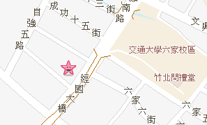
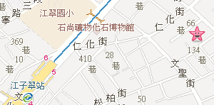

My house and family
====================

.. contents::
   :local:
   :depth: 4

My Zhubei's house
------------------

Location
~~~~~~~~

- Address: `新竹縣竹北市鹿場里自強南路430巷10號 <http://www.map.com.tw?x=121.0213&y=24.81111 &l=10&t1=%E6%96%B0%E7%AB%B9%E7%B8%A3%E7%AB%B9%E5%8C%97%E5%B8%82%E9%B9%BF%E5%A0%B4%E9%87%8C%E8%87%AA%E5%BC%B7%E5%8D%97%E8%B7%AF430%E5%B7%B710%E8%99%9F&t2=%E6%96%B0%E7%AB%B9%E7%B8%A3%E7%AB%B9%E5%8C%97%E5%B8%82%E9%B9%BF%E5%A0%B4%E9%87%8C%E8%87%AA%E5%BC%B7%E5%8D%97%E8%B7%AF430%E5%B7%B710%E8%99%9F>`_

E5%A0%B4%E9%87%8C%E8%87%AA%E5%BC%B7%E5%8D%97%E8%B7%AF430%E5%B7%B710%E8%99%9F

.. raw:: html

  

  <table class="main_tables" summary="廠家的地圖" cellpadding="0" cellspacing="0" border="0">
  <tr>
  <td align="center" valign="top" id="Org_MAP_md">
  

  </td>
  </tr>
  </table>

- `From High speed train station 新竹六家 Hsinchu Liujiu or traditional train station 六家 Liujiu to my house <https://www.google.com.tw/maps/dir/Liujia/%E8%A8%98%E6%86%B6%E8%A8%AD%E8%A8%88+remember+DESIGN/@24.8055094,121.027765,15z/data=!4m13!4m12!1m5!1m1!1s0x346837a9f81c55a7:0xc35f931e4e7163d1!2m2!1d121.0393!2d24.807527!1m5!1m1!1s0x0:0xc8a5a2cdd84febd2!2m2!1d121.021504!2d24.8108247?hl=en>`_

- `從高鐵新竹六家或台鐵六家火車站到我家 <https://www.google.com.tw/maps/dir/六家火車站/24.8109333,121.0213869/@24.8136106,121.0257421,15z/data=!4m9!4m8!1m5!1m1!1s0x346837a9f81c55a7:0xc35f931e4e7163d1!2m2!1d121.0393!2d24.807527!1m0!3e0?hl=zh-TW>`_

- `From Train station 竹北 to my house (This route is for driving, riding motobike, or biking) <https://www.google.com.tw/maps/dir/Zhubei/記憶設計+remember+DESIGN/@24.8250357,121.0092111,14.94z/data=!4m13!4m12!1m5!1m1!1s0x346836bf742d4d87:0x349682f7dca3bf9b!2m2!1d121.0091827!2d24.8390679!1m5!1m1!1s0x0:0xc8a5a2cdd84febd2!2m2!1d121.021504!2d24.8108247?hl=en>`_

  - The side which close to dike on Xinglong Road has bike trail.
  
- `從竹北火車站到我家(這條路可開車騎機車或腳踏車) <https://www.google.com.tw/maps/dir/%E7%AB%B9%E5%8C%97%E7%81%AB%E8%BB%8A%E7%AB%99/24.8109333,121.0213869/@24.826243,121.0025964,15.19z/data=!4m9!4m8!1m5!1m1!1s0x346836bf742d4d87:0x349682f7dca3bf9b!2m2!1d121.0091827!2d24.8390679!1m0!3e0?hl=zh-TW>`_

  - 興隆路靠河堤那一邊有腳踏車專用道 ggg

- alpha eee fff

Basement (garage)
~~~~~~~~~~~~~~~~~

.. table:: garage

  ===================================================  ========================================
  .. image:: ../pictures/ZhubeiHouse/IMG_0176.png      .. image:: ../pictures/ZhubeiHouse/IMG_0173.png 
  ===================================================  ========================================

Ground floor (kitchen & living room)
~~~~~~~~~~~~~~~~~~~~~~~~~~~~~~~~~~~~

.. table:: kitchen & living room

  ===================================================  ========================================
  .. image:: ../pictures/ZhubeiHouse/IMG_0085.png      .. image:: ../pictures/ZhubeiHouse/IMG_0086.png 
  ===================================================  ========================================

2nd floor (kid & guest room)
~~~~~~~~~~~~~~~~~~~~~~~~~~~~

.. table:: kid & guest room

  ===================================================  ========================================
  .. image:: ../pictures/ZhubeiHouse/IMG_0112.png      .. image:: ../pictures/ZhubeiHouse/IMG_0198.png 
  ===================================================  ========================================

3rd floor (work/book place)
~~~~~~~~~~~~~~~~~~~~~~~~~~~

.. table:: work/book place

  ===================================================  ========================================
  .. image:: ../pictures/ZhubeiHouse/IMG_0123.png      .. image:: ../pictures/ZhubeiHouse/IMG_0125.png 
  ---------------------------------------------------  ----------------------------------------
  .. image:: ../pictures/ZhubeiHouse/IMG_0171.png      .. image:: ../pictures/ZhubeiHouse/IMG_0207.png 
  ===================================================  ========================================

4th floor (master room)
~~~~~~~~~~~~~~~~~~~~~~~

.. table:: master room

  ===================================================  ========================================
  .. image:: ../pictures/ZhubeiHouse/IMG_0153.png      .. image:: ../pictures/ZhubeiHouse/IMG_0157.png 
  ---------------------------------------------------  ----------------------------------------
  .. image:: ../pictures/ZhubeiHouse/IMG_0159.png      .. image:: ../pictures/ZhubeiHouse/IMG_0226.png 
  ---------------------------------------------------  ----------------------------------------
  .. image:: ../pictures/ZhubeiHouse/IMG_0708.png      .. image:: ../pictures/ZhubeiHouse/IMG_0709.png 
  ---------------------------------------------------  ----------------------------------------
  .. image:: ../pictures/ZhubeiHouse/IMG_0167.png      .. image:: ../pictures/ZhubeiHouse/IMG_0241.png 
  ---------------------------------------------------  ----------------------------------------
  .. image:: ../pictures/ZhubeiHouse/IMG_0247.png      .. image:: ../pictures/ZhubeiHouse/IMG_0255.png 
  ===================================================  ========================================

5th floor and Look out
~~~~~~~~~~~~~~~~~~~~~~

.. table:: 5th floor and Look out

  ===================================================  ========================================
  .. image:: ../pictures/ZhubeiHouse/IMG_0258.png      .. image:: ../pictures/ZhubeiHouse/IMG_0185.png 
  ===================================================  ========================================

My old apartment in Banchiao  
----------------------------

Location
~~~~~~~~

- Address: 3F, No. 9, Lane 66, Huaide St, Banqiao District, New Taipei City, 220 

- `地址: 新北市板橋區嵐翠里懷德街66巷9號3樓 <http://www.map.com.tw?x=121.477401&y=25.031912 &l=10&t1=%E6%96%B0%E5%8C%97%E5%B8%82%E6%9D%BF%E6%A9%8B%E5%8D%80%E5%B5%90%E7%BF%A0%E9%87%8C%E6%87%B7%E5%BE%B7%E8%A1%9766%E5%B7%B79%E8%99%9F&t2=%E6%96%B0%E5%8C%97%E5%B8%82%E6%9D%BF%E6%A9%8B%E5%8D%80%E5%B5%90%E7%BF%A0%E9%87%8C%E6%87%B7%E5%BE%B7%E8%A1%9766%E5%B7%B79%E8%99%9F>`_

%E9%87%8C%E6%87%B7%E5%BE%B7%E8%A1%9766%E5%B7%B79%E8%99%9F

- `From MRT 江子翠 Jiangzicui station to my house <https://www.google.com.tw/maps/dir/Jiangzicui+Station/25.0319758,121.4774463/@25.0314429,121.4739545,18.01z/data=!4m14!4m13!1m10!1m1!1s0x3442a8411a36bf6f:0x2cd69326684fed1!2m2!1d121.472389!2d25.030009!3m4!1m2!1d121.4775619!2d25.0318507!3s0x3442a845c92ddf37:0x4eb48085c8a1e774!1m0!3e2?hl=en>`_

  - The English version cannot find my house while the Chinese version as the following can find.

- `從捷運江子翠站到我家 <https://www.google.com.tw/maps/dir/%E6%8D%B7%E9%81%8B%E6%B1%9F%E5%AD%90%E7%BF%A0%E7%AB%99/220%E6%96%B0%E5%8C%97%E5%B8%82%E6%9D%BF%E6%A9%8B%E5%8D%80%E6%87%B7%E5%BE%B7%E8%A1%9766%E5%B7%B79%E8%99%9F/@25.0318629,121.475171,17z/data=!4m14!4m13!1m5!1m1!1s0x3442a8411a36bf6f:0x2cd69326684fed1!2m2!1d121.472389!2d25.030009!1m5!1m1!1s0x3442a845cc04e5fd:0xb7232511d05c6c19!2m2!1d121.477365!2d25.0318629!3e0>`_

Pictures
~~~~~~~~

.. table:: My old apartment

  ====================================================  ========================================
  .. image:: ../pictures/BanqiaoApartment/IMG_0837.png  .. image:: ../pictures/BanqiaoApartment/IMG_0839.png 
  ----------------------------------------------------  ----------------------------------------
  .. image:: ../pictures/BanqiaoApartment/IMG_0840.png    
  ====================================================  ========================================
